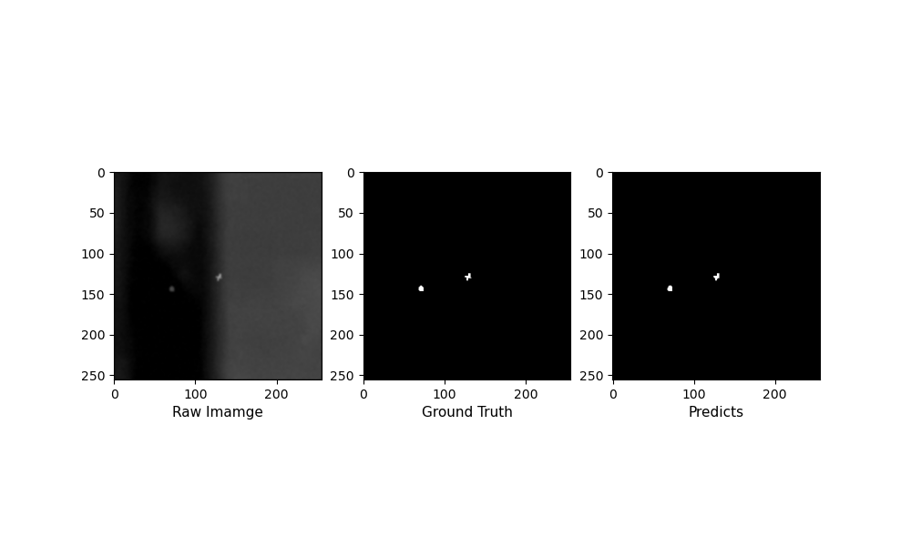

# Jittor-Implementation-of-DNANet
本项目使用计图框实现论文[Dense Nested Attention Network for Infrared Small Target Detection](https://ieeexplore.ieee.org/document/9864119)的复现
## 环境配置
    jittor==1.3.6.6
    numpy==1.26.4
    opencv==4.10.0.84
    torch
    torchvision
    torchaudio
    scikit-image
## 数据准备
[NUDT-SIRST数据集下载链接](https://pan.baidu.com/s/1WdA_yOHDnIiyj4C9SbW_Kg?pwd=nudt)\
数据会在训练时自动加载和预处理，因此不需要单独运行数据准备脚本
## 训练
###### 运行如下脚本进行训练
    python train_jittor.py
训练过程log见result_jt/NUDT-SIRST_DNANet_24_05_2025_20_16_48_wDS/NUDT-SIRST_DNANet_best_IoU_IoU.log和result_jt/NUDT-SIRST_DNANet_24_05_2025_20_16_48_wDS/NUDT-SIRST_DNANet_best_IoU_other_metric.log\
loss曲线如下\

## 测试
###### 运行如下脚本进行模型测试
    python test_jittor.py
###### 运行如下脚本进行模型结果可视化
    python visualize_jittor.py
## 与pytorch实现对齐情况
### 模型结构对齐结果
    batch0: mean error: 1.5180783634605177e-06
    batch1: mean error: 1.872919156653552e-06
    batch2: mean error: 1.7960948639483831e-06
    batch3: mean error: 9.533109164294729e-07
### 数据读取对齐结果
    batch0: image error=1.0291081053992457e-07
    batch0: mask error=0.0
    batch1: image error=1.0811435657842594e-07
    batch1: mask error=0.0
    batch2: image error=8.173225296559394e-08
    batch2: mask error=0.0
    batch3: image error=8.442816579190549e-08
    batch3: mask error=0.0
    batch4: image error=4.1753008162004335e-08
    batch4: mask error=0.0
    batch5: image error=7.112476652082478e-08
    batch5: mask error=0.0
    batch6: image error=5.3021675938680346e-08
    batch6: mask error=0.0
    batch7: image error=9.974097103793156e-09
    batch7: mask error=0.0
    batch8: image error=1.7178255262706443e-08
    batch8: mask error=0.0
    batch9: image error=4.607211323559568e-08
    batch9: mask error=0.0
### 评估指标对齐结果
    ture_positive_rate error=[0. 0. 0. 0. 0. 0. 0. 0. 0. 0. 0.]
    false_positive_rate error=[0. 0. 0. 0. 0. 0. 0. 0. 0. 0. 0.]
    recall error=[0. 0. 0. 0. 0. 0. 0. 0. 0. 0. 0.]
    precision error=[0. 0. 0. 0. 0. 0. 0. 0. 0. 0. 0.]
    pixAcc error=0.0
    mIoU error=0.0
    FA error=[0. 0. 0. 0. 0. 0. 0. 0. 0. 0. 0.]
    PD error=[0. 0. 0. 0. 0. 0. 0. 0. 0. 0. 0.]
### 损失函数对齐结果
    batch0: mean error: 8.106231689453125e-05
    batch1: mean error: 7.43865966796875e-05
    batch2: mean error: 8.654594421386719e-05
    batch3: mean error: 8.177757263183594e-05
### 反向传播对齐结果
    error_loss=[-1.78813934e-07 -1.35302544e-05 -1.96695328e-05 -5.63919544e-04 -2.51114368e-04 -4.81486320e-04]
    error_lr=[[0. 0. 0. 0. 0. 0.]]
## 性能
模型训练450轮后的mIoU为：0.7496\
原pytorch训练450轮后的mIoU为：0.7661\
使用jittor框架实现的DNANet检测红外小目标结果示例如下\

